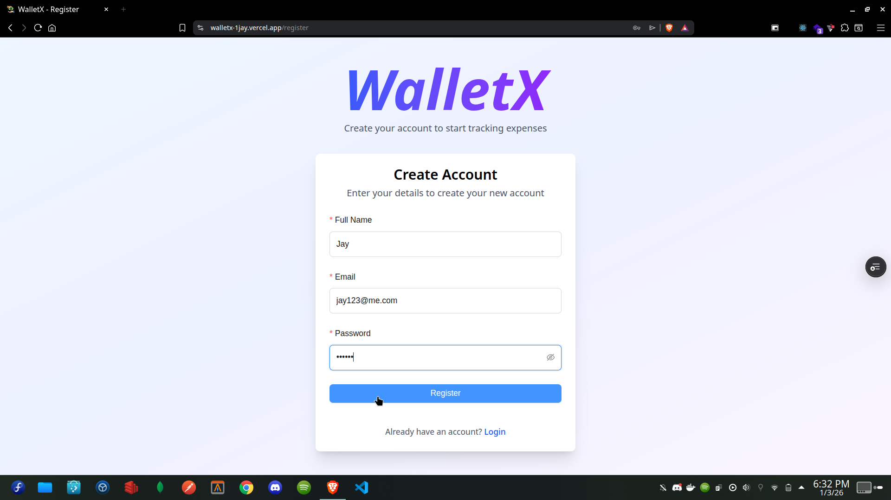
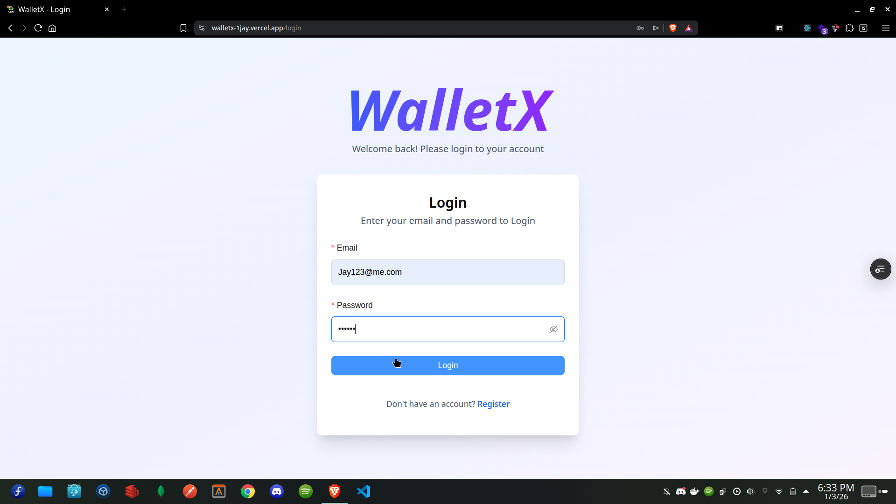
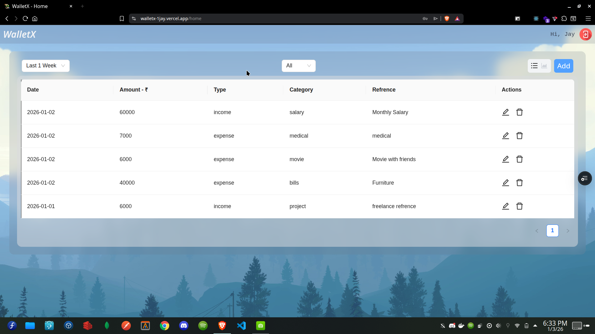
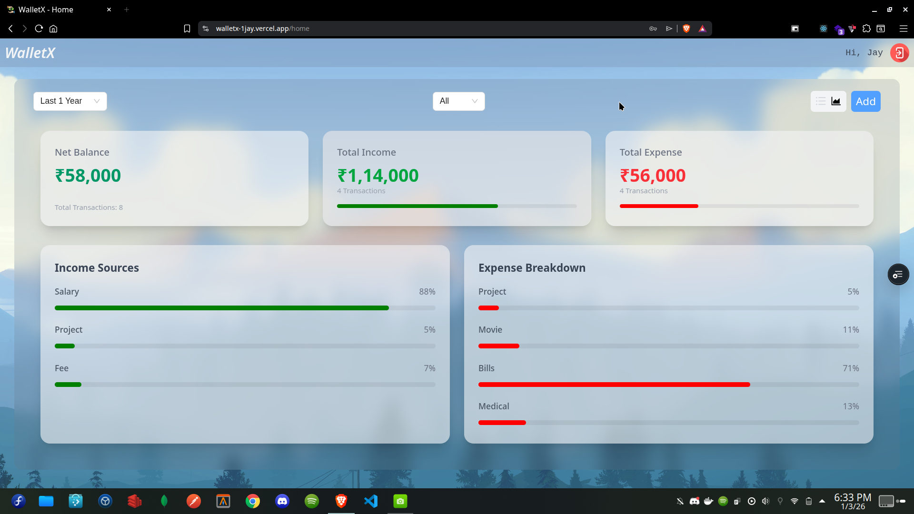
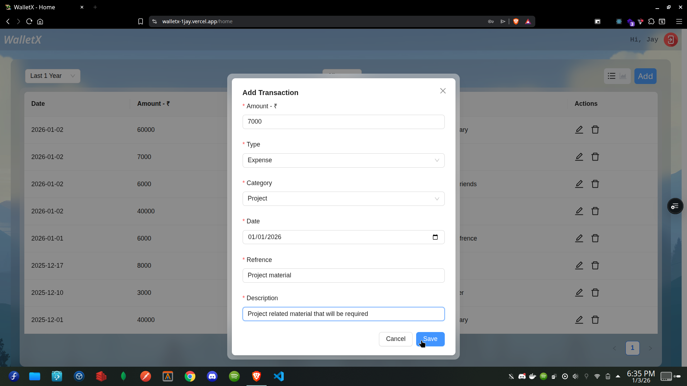

# WalletX

**WalletX** is a production-grade, full-stack financial management platform designed to track income, expenses, and transaction history in real-time.

Going beyond a standard MERN application, WalletX demonstrates **DevOps maturity** by utilizing a custom cloud infrastructure. The backend is containerized with **Docker**, orchestrated on **AWS EC2**, managed via **Nginx** reverse proxy, and secured with **SSL/TLS encryption (HTTPS)** using Certbot.

### **Frontend**

- **Core:** React.js (Vite Build Tool)
- **Styling:** Tailwind CSS (Responsive Design)
- **State & Effects:** Context API, React Hooks (useEffect)
- **Networking:** Axios (HTTP Client)

### **Backend**

- **Runtime:** Node.js & Express.js
- **Database:** MongoDB (Mongoose ODM)
- **Security:** Express-Rate-Limit, CORS, Helmet
- **API Style:** RESTful Architecture

### **DevOps & Cloud Infrastructure**

- **Cloud Provider:** AWS EC2 (Ubuntu Instance)
- **Containerization:** Docker (Custom Node.js Image)
- **Web Server:** Nginx (Reverse Proxy & Load Balancing)
- **Security & DNS:** HTTPS/SSL via Certbot (Let's Encrypt), DuckDNS

---

## Key Architecture Highlights

- **Production-Grade DevOps:** Moved beyond PaaS by manually configuring an **AWS EC2** instance with **Docker** containers for full environment isolation.
- **Secure Networking:** Implemented **Nginx** as a reverse proxy to handle port forwarding and serve the API securely over **HTTPS (SSL/TLS)**.
- **DDoS Protection:** integrated **Rate Limiting** middleware to restrict abusive IP traffic and prevent brute-force attacks.
- **Decoupled Architecture:** Frontend hosted on Vercel (CI/CD) communicating securely with the Dockerized backend on AWS.

</img>
</img>
</img>
</img>
</img>
